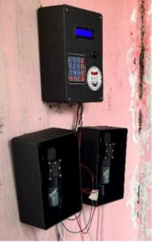
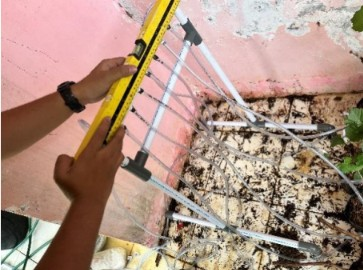

# Smart Grape Irrigation System

An ESP32-based automatic irrigation system designed to assist grape farmers by providing scheduled and manual watering control. The system utilizes a Real-Time Clock (RTC) for scheduling, a keypad for user input, and a relay-controlled water pump for irrigation.

This project was developed as part of the Community Service Learning (CSL) Program at Arjasari Village, Bandung, Indonesia.

---

## Features

- Automatic irrigation based on predefined schedules
- Manual irrigation mode
- RTC-based time management
- Keypad interface for configuration
- LCD display for system monitoring
- Relay-controlled water pump
- ESP32-based embedded control system

---

## Hardware Components

- ESP32
- DS3231 Real-Time Clock (RTC)
- 16x2 LCD with I2C Module
- 4x4 Keypad
- Relay Module
- DC Water Pump
- Power Supply

---

## System Architecture


---

## Working Principle

1. The user configures irrigation schedules using the keypad.
2. The RTC continuously provides real-time clock information.
3. The ESP32 compares the current time with the scheduled irrigation time.
4. When the scheduled time is reached, the relay is activated.
5. The relay turns on the water pump to irrigate the grape plants.
6. The LCD displays the current system status and irrigation information.

---

## Prototype

### Hardware Prototype



### Field Implementation



---

## Software

The Arduino source code is available in:

```
software/
```

---

## Video Demonstration

[Project Demonstration Video]([https://your-video-link](https://www.instagram.com/reel/C_XQAJRsIN8/?utm_source=ig_web_copy_link&igsh=MzRlODBiNWFlZA==))

---

## Project Impact

The system was deployed and introduced to local farmers in Arjasari Village, Bandung, to support more efficient irrigation practices and reduce manual labor requirements.
